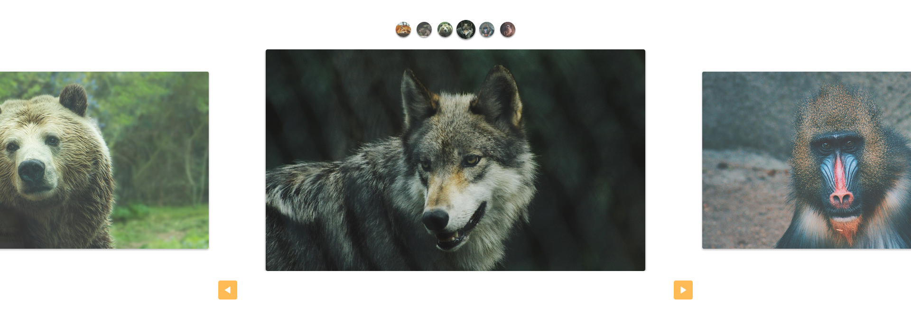

# Slides Animais Fantásticos 

> Slides do tipo carrossel desenvolvidos utilizando POO para o site Animais Fantásticos.

### Ajustes e melhorias

Projeto concluído!

- [x] Implementação das funcionalidades dos slides em JavaScript
- [x] Desenvolvimento responsivo

## 💻 Pré-requisitos

Antes de começar, verifique se você atendeu aos seguintes requisitos:

* Você instalou a versão mais recente de `Node.js`

## 🚀 Instalando Slides Animais Fantásticos 

Para instalar o Slides Animais Fantásticos, siga estas etapas:

* Clone esse repositório com `git clone https://github.com/gguilhermelopes/slide-animais-fantasticos`
* Utilze uma extensão como a Live Server do VSCode em sua IDE para melhor visualização do site localmente

## ☕ Usando Slides Animais Fantásticos 

Para usar Slides Animais Fantásticos, siga estas etapas:

* Abra o seu Live Server!
